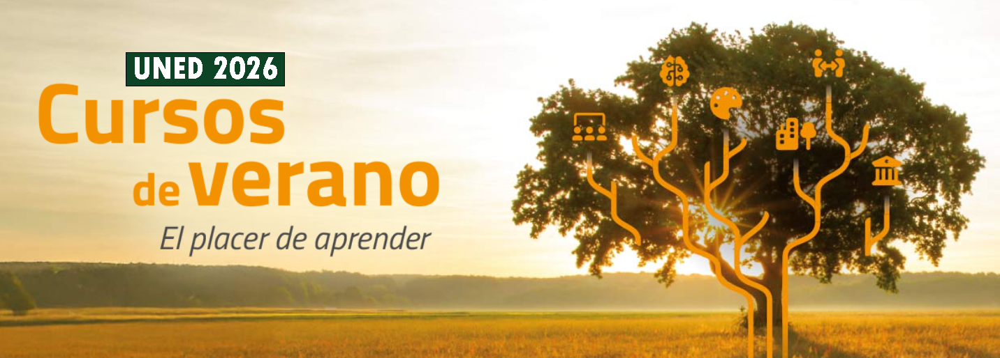

# **Análisis y Visualización de Datos: Estadística Práctica con R e Inteligencia Artificial**

## ***Cursos de Verano de la UNED en Plasencia (8-10 de julio de 2026)***

------------------------------------------------------------------------

## [Contenidos y Planificación:](figuras/triptico.pdf)

------------------------------------------------------------------------

## [Cuestionario: ¿Qué te ha parecido el curso?](https://forms.office.com/e/vdGRntxrVB)

