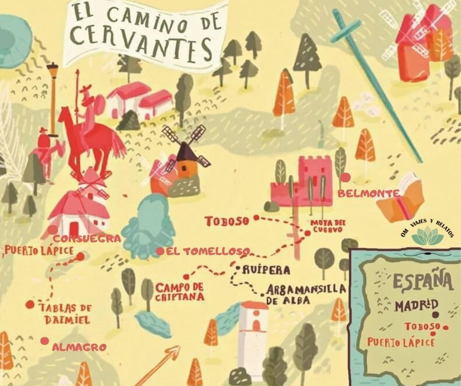

## ¿Es Villanueva de los Infantes El lugar de La Mancha? {#sec-intro}

{#fig-quijote fig-align="center"}

------------------------------------------------------------------------

## Texto El Quijote {.scrollable}

[*En un lugar de la Mancha*]{.underline}^[***2***](https://cvc.cervantes.es/literatura/clasicos/quijote/edicion/parte1/cap01/default.htm#np2n)^*, de cuyo nombre no quiero acordarme^[3](https://cvc.cervantes.es/literatura/clasicos/quijote/edicion/parte1/cap01/default.htm#np3n)^, no ha mucho tiempo que vivía un hidalgo de los de lanza en astillero, adarga antigua, rocín flaco y galgo corredor^[4](https://cvc.cervantes.es/literatura/clasicos/quijote/edicion/parte1/cap01/default.htm#np4n)^. Una olla de algo más vaca que carnero, salpicón las más noches^[5](https://cvc.cervantes.es/literatura/clasicos/quijote/edicion/parte1/cap01/default.htm#np5n)^, duelos y quebrantos los sábados^[6](https://cvc.cervantes.es/literatura/clasicos/quijote/edicion/parte1/cap01/default.htm#np6n)^, lantejas los viernes^[7](https://cvc.cervantes.es/literatura/clasicos/quijote/edicion/parte1/cap01/default.htm#np7n)^, algún palomino de añadidura los domingos^[8](https://cvc.cervantes.es/literatura/clasicos/quijote/edicion/parte1/cap01/default.htm#np8n)^, consumían las tres partes de su hacienda^[9](https://cvc.cervantes.es/literatura/clasicos/quijote/edicion/parte1/cap01/default.htm#np9n)^. El resto della concluían sayo de velarte^[10](https://cvc.cervantes.es/literatura/clasicos/quijote/edicion/parte1/cap01/default.htm#np10n)^, calzas de velludo para las fiestas, con sus pantuflos de lo mesmo^[11](https://cvc.cervantes.es/literatura/clasicos/quijote/edicion/parte1/cap01/default.htm#np11n)^, y los días de entresemana se honraba con su vellorí de lo más fino^[12](https://cvc.cervantes.es/literatura/clasicos/quijote/edicion/parte1/cap01/default.htm#np12n)^. Tenía en su casa una ama que pasaba de los cuarenta y una sobrina que no llegaba a los veinte, y un mozo de campo y plaza que así ensillaba el rocín como tomaba la podadera^[13](https://cvc.cervantes.es/literatura/clasicos/quijote/edicion/parte1/cap01/default.htm#np13n)^. Frisaba la edad de nuestro hidalgo con los cincuenta años^[14](https://cvc.cervantes.es/literatura/clasicos/quijote/edicion/parte1/cap01/default.htm#np14n)^. Era de complexión recia, seco de carnes, enjuto de rostro^[15](https://cvc.cervantes.es/literatura/clasicos/quijote/edicion/parte1/cap01/default.htm#np15n)^, gran madrugador y amigo de la caza. Quieren decir que tenía el sobrenombre de «Quijada», o «Quesada», que en esto hay alguna diferencia en los autores que deste caso escriben, aunque por conjeturas verisímiles^[II](https://cvc.cervantes.es/literatura/clasicos/quijote/edicion/parte1/cap01/default.htm#acn2)^ se deja entender que se llamaba «**Quijana**»^[III](https://cvc.cervantes.es/literatura/clasicos/quijote/edicion/parte1/cap01/default.htm#acn3), [16](https://cvc.cervantes.es/literatura/clasicos/quijote/edicion/parte1/cap01/default.htm#np16n)^. Pero esto importa poco a nuestro cuento: basta que en la narración dél no se salga un punto de la verdad. [@libroquijote]*

------------------------------------------------------------------------

Un grupo de investigadores ha recolectado evaluaciones subjetivas de expertos en literatura, historia y cultura manchega sobre cuatro pueblos candidatos a ser el famoso "lugar de La Mancha de cuyo nombre no quiero acordarme".

Los **criterios de evaluación** son:

::: {nonincremental}
-   Idealismo cervantino

-   Ambiente rural que encaja con la novela

-   Presencia de tradiciones caballerescas

-   Probabilidad histórica percibida
:::

------------------------------------------------------------------------

Los **pueblos candidatos** son:

::: incremental
-   Argamasilla de Alba

-   Villanueva de los Infantes

-   Campo de Criptana

-   El Toboso
:::

## Mapa de Castilla La Mancha {#sec-mapa}

Para averiguar cual es el verdadero lugar de la mancha, hay que tener en cuenta el mapa de carreteras de la épica.

La @fig-mapa muestra el mapa de Castilla La Mancha que tenía Don Quijote.

{#fig-mapa}

Imagen obtenida de <https://omviajesyrelatos.com/>

## Mapa Interactivo

```{r}
#| label: mapa-interactivo
#| error: true
library(leaflet)

leaflet() |>
  setView(lng = -3.0103, lat = 38.73613, zoom = 15) |>
  addTiles() |>
  addMarkers(lng = -3.0103, lat = 38.7361, popup = "Villanueva de los Infantes")
```

## Descripción distancias {#sec-distancias}

Las distancias se calculan según la fórmula de Euler:

$$\sqrt{(x_1-x_2)^2+(y_1-y_2)^2}$$ {#eq-distancia}

------------------------------------------------------------------------

La siguiente tabla recoge las distancias de los principales pueblos de Castilla La Mancha:

```{r}
#| label: tabla
#| error: true
library(DT)

datos_tabla<-read.csv("C:/Users/eaesc/Downloads/curso_verano/Ejercicio Quijote/distancias_CLM.csv",sep="|")
DT::datatable(datos_tabla, editable = 'cell')
```

------------------------------------------------------------------------

Las variables x e y son las coordenadas, y las variables PL, SM, ET y MU son las distancias de cada pueblo a Puerto Lápice, Sierra Morena y El Toboso, más la correspondiente al denominado *punto Tarfe [@gonzalez2008donde]*.

#Datos

## Investigación {#sec-investigacion}

Para determinar si Villanueva de los Infantes es el pueblo de Don Quijote, los investigadores se han hecho las siguientes preguntas:

-   ¿Es Argamasilla de Alba percibida como significativamente menos idealista que Villanueva de los Infantes?

-   ¿Aumenta significativamente la valoración de Villanueva tras leer El Quijote?

-   ¿Hay diferencias significativas en la percepción "quijotesca" entre los cuatro pueblos? Si hay diferencias, ¿cuáles destacan?

-   ¿Cuál es el criterio más valorado en Villanuev de los Infantes? ¿Las diferencias entre criterios son significativas?

## Pruebas {#sec-pruebas}

Esta sección recoge los datos recopilados para responder a las preguntas anteriores.

##### Prueba 1: Comparación entre la idealidad de dos pueblos {#sec-pruebas1}

| Evaluador | Argmasilla | Villanueva de los Infantes |
|-----------|------------|----------------------------|
| E1        | 8          | 6                          |
| E2        | 9          | 5                          |
| E3        | 7          | 6                          |
| E4        | 8          | 4                          |
| E5        | 9          | 5                          |

: Datos Prueba 1 {#tbl-prueba1}

------------------------------------------------------------------------

##### Prueba 2: Comparación de la percepción histórica antes y después de leer el Quijote {#sec-prueba2}

| Evaluador | Antes leer | Después Leer |
|-----------|------------|--------------|
| E1        | 6          | 9            |
| E2        | 7          | 9            |
| E3        | 5          | 7            |
| E4        | 6          | 8            |
| E5        | 5          | 8            |

: Datos Prueba 2 {#tbl-prueba2}

------------------------------------------------------------------------

##### Prueba 3: Comparación entre los cuatro pueblos {#sec-prueba3}

| Evaluador | Argamasilla | Villanueva | Criptana | Toboso |
|-----------|-------------|------------|----------|--------|
| E1        | 8           | 6          | 9        | 7      |
| E2        | 9           | 5          | 10       | 6      |
| E3        | 8           | 5          | 9        | 6      |
| E4        | 9           | 4          | 8        | 5      |

: Datos Prueba 3 {#tbl-prueba3}

------------------------------------------------------------------------

##### Prueba 4: Comparación entre los criterios de evaluación en un mismo pueblo {#sec-prueba4}

| Evaluador | Idealismo | Ambiente rural | Tradición caballeresca | Probabilidad histórica |
|---------------|---------------|---------------|---------------|---------------|
| Argamasilla | 7 | 6 | 5 | 8 |
| Villanueva de los Infantes | 6 | 7 | 5 | 9 |
| Campo de Criptana | 7 | 6 | 6 | 8 |
| El Toboso | 8 | 5 | 6 | 9 |

: Datos Prueba 4 {#tbl-prueba4}

------------------------------------------------------------------------

#### Prueba 1: Test de Mann-Whitney {#sec-analisis-p1}

###### Análisis descriptivo:

```{r}
#|label: setup
#| echo: true
library(pgirmess)
library(clinfun)
library(psych)
library(pastecs)
library(car)
library(ggplot2)
```

```{r}
#|label: datos-prueba1
#| echo: true
villanueva<-c(8,9,7,8,9)
argamasilla<-c(6,5,6,4,5)
n<-length(argamasilla)
pueblo<-gl(2,n,length=2*n,labels=c("Argamasilla","Villanueva"),ordered=T)
opiniones<-c(argamasilla,villanueva)
datos<-data.frame(opiniones=opiniones, pueblo=pueblo)

```

```{r}
#| label: exploracion-p1
#| echo: true
#Exploración datos
#################
#Graficos
boxplot(opiniones ~ pueblo,data=datos)


```

------------------------------------------------------------------------

```{r}
#| label: exploracion-p11
#| echo: true

#Estadísticos

analisis_descriptivo<-by(datos[, c("opiniones")], datos$pueblo, stat.desc, basic = FALSE,
   norm = TRUE)

analisis_descriptivo

media_argamasilla<-analisis_descriptivo$Argamasilla[2]
media_villanueva<-analisis_descriptivo$Villanueva[2]

```

------------------------------------------------------------------------

###### Test Mann-Whitney:

```{r}
#| label: test-mann-whitney
#| echo: true
#Contraste Mann-Whitney
######################
#Test
prueba1Model<-wilcox.test(opiniones ~ pueblo, data = datos, exact = FALSE,correct= FALSE)

prueba1Model

p1_pvalor<-prueba1Model$p.value
W<-prueba1Model$statistic


```

------------------------------------------------------------------------

###### Tamaño del efecto:

```{r}
#| label: tamanyo-efecto-p1
#| echo: true
#Tamaño del efecto
rFromWilcox<-function(wilcoxModel, N){
  z<- qnorm(wilcoxModel$p.value/2)
  r<- z/ sqrt(N)
  cat(wilcoxModel$data.name, "Effect Size, r = ", r)
  return (r)
 
}

rFromWilcox(prueba1Model, 20)
p1_efecto<-rFromWilcox(prueba1Model, 20)

```

------------------------------------------------------------------------

#### Prueba 2: Test de rangos signados de Wilcoxon

###### Importación datos:

```{r}
#| label: datos-2
#| echo: true
#Importación datos
##################
grupo<-gl(2,5,length=10,labels=c("Antes leer","Después leer"),ordered=T)
antes<-c(6,7,5,6,5)
despues<-c(9,9,7,8,8)

datos<-data.frame(grupo=grupo,opinion=c(antes,despues))
```

------------------------------------------------------------------------

###### Análisis descriptivo datos:

```{r}
#| label: exploracion-p2
#| echo: true
#Exploración datos
#################
#Graficos
boxplot(opinion~ grupo,data=datos)


```

------------------------------------------------------------------------

```{r}
#| label: exploracion-p22
#| echo: true
#Estadísticos
ad_p2<-by(datos[, c("opinion")], datos$grupo, stat.desc, basic = FALSE,
   norm = TRUE)
ad_p2

media_antes<-ad_p2$`Antes leer`[2]
media_despues<-ad_p2$`Después leer`[2]

```

------------------------------------------------------------------------

###### Test rangos signados de Wilcoxon:

```{r}
#| label: test wilcoxon
#| echo: true
#Contraste Rangos Signados de Wilcoxon
######################
#Test

prueba2Model<-wilcox.test(antes, despues,paired=T,correct=F)
prueba2Model

p2_pvalor<-prueba2Model$p.value
V<-prueba2Model$statistic
```

------------------------------------------------------------------------

###### Tamaño del efecto:

```{r}
#| label: efecto-p2c
#| echo: true
rFromWilcox(prueba2Model, 20)

```

------------------------------------------------------------------------

#### Prueba 3: Test de Kruskal Wallis {#sec-analisis-p3}

###### Importación datos:

```{r}
#| label: datos-p3
#| echo: true
#Importación datos
grupo<-gl(4, 4, labels = c("Criptana","Argamasilla","Villanueva","Toboso"))
opinion<-c(8,9,8,9,
           6,5,5,4,
           9,10,9,8,
           7,6,6,5)


datos<-data.frame(opinion, grupo)
datos$grupo<-factor(datos$grupo, levels = levels(datos$grupo)[c(1,2,3,4)])
```

------------------------------------------------------------------------

###### Análisis descriptivo datos:

```{r}
#| label: exploracion-p3
#| echo: true
#Graficos
ggplot(datos, aes(x = grupo, y = opinion, fill = grupo)) +
  geom_boxplot() +
  labs(
    title = "Boxplot opiniones expertos por pueblo",
    x = "Pueblos",
    y = "Opiniones"
  ) +
  theme_minimal() +
  theme(legend.position = "none")


```

------------------------------------------------------------------------

```{r}

#Estadísticos
by(datos[, c("opinion")], datos$grupo, stat.desc, basic = F)                                
```

------------------------------------------------------------------------

###### Test de Kruskal Wallis:

```{r}
#| label: test-kruskal-wallis
#| echo: true
#Contraste
prueba3Model<-kruskal.test(opinion ~ grupo, data = datos)
prueba3Model

p3_pvalor<-prueba3Model$p.value
H<-prueba3Model$statistic
```

------------------------------------------------------------------------

###### Análisis rangos:

```{r}
#| label: analisis-rangos-p3
#| echo: true
datos$Ranks<-rank(datos$opinion)

by(datos$Ranks, datos$grupo, mean)
```

------------------------------------------------------------------------

###### Test de comparaciones múltiples:

```{r}
#| label: comparaciones-multiples-p3
#| echo: true
#Test comparaciones Múltiples
cm<-kruskalmc(opinion ~ grupo, data = datos)
cm

diferencias_kw<-row.names(cm$dif.com[cm$dif.com["stat.signif"]==TRUE,])

```

------------------------------------------------------------------------

#### Prueba 4: Test de Friedman {#sec-analisis-p4}

###### Importación datos:

```{r}
#| label: datos-p4
#| echo: true
#Importacion datos
##################

idealismo<-c(7,6,7,8)
ambiente<-c(6,7,6,5)
tradicion<-c(5,5,6,6)
probabilidad<-c(8,9,8,9)

datos<-data.frame(puntuaciones=c(idealismo, ambiente, tradicion, probabilidad),
                  criterio=gl(4,4,16,labels=c("Idealismo","Ambiente","Tradición","Probabilidad")))
```

------------------------------------------------------------------------

###### Análisis descriptivo datos:

```{r}
#| label: exploracion-p4
#| echo: true
#Exploración datos
#################
#Graficos
boxplot(puntuaciones~ criterio,data=datos)
```

------------------------------------------------------------------------

```{r}
#| label: exploracion-p42
#| echo: true
#Estadísticos
by(datos[, c("puntuaciones")], datos$criterio, stat.desc, basic = FALSE,
   norm = TRUE)
```

------------------------------------------------------------------------

###### Test de Friedman:

```{r}
#| label: test-friedman
#| echo: true
#Test
#####
#Quitamos datos perdidos (si los hubiera).
#Los datos tienen que pasarse como matriz al test
datos<-matrix(c(idealismo, ambiente, tradicion, probabilidad),nrow=4,ncol=4)
datos <- as.matrix(na.omit(datos))

prueba4Model<-friedman.test(datos)
prueba4Model

p4_pvalor<-prueba4Model$p.value
Fr<-prueba4Model$statistic
```

------------------------------------------------------------------------

###### Test de comparaciones múltiples:

```{r}
#| label: comparaciones_multiples-p4
#| echo: true
#Test comparaciones múltiples
cmf<-friedmanmc(datos) 

cmf

diferencias_f<-row.names(cmf$dif.com[cmf$dif.com["stat.signif"]==TRUE,])
 
```

------------------------------------------------------------------------

## Conclusiones {.scrollable}

### Análisis descriptivo:

::: incremental
-   Parece que hay una diferencia significativa entre las opiniones de los expertos sobre si es Argamasilla o Villanueva el pueblo de El Quijote. Las puntuaciones parecen significaivamente mayores para Villanueva.

-   Observando los diagramas de cajas de las variables antes y después de leer la novela, se deduce que parece que existe una diferencia significativa, y que la probabilidad aumenta después de leer el libro.

-   No parece que hay una gran diferencia de opiniones entre los pueblos.

-   Criptana y Villanueva parecen ser los pueblos más probables, aunque quizás Villanueva tiene levemente mayor puntuación.

-   La probabilidad histórica parece el criterio decisivo para elegir El Lugar de La Mancha.
:::

------------------------------------------------------------------------

### Test no paramétricos {.scrollable}

#### Prueba 1:

::: incremental
-   El estadístico de contraste fue de W=`r W` , y el p-valor de `r round(p1_pvalor,4)` por lo tanto `r ifelse(p1_pvalor<0.05, "Se rechaza", "No se rechaza")` la hipótesis nula.

-   Por tanto `r ifelse(p1_pvalor<0.05,"","no")` existen diferencias significativas entre las puntuaciones de Villanueva y Argamasilla. `r ifelse(p1_pvalor<0.05, paste("Como la media de Villanueva es ", ifelse(media_villanueva>media_argamasilla,"mayor","menor"), " es más probable que el pueblo de El Quijote sea",ifelse(media_villanueva>media_argamasilla,"Villanueva.","Argamasilla.")),"")`
:::

------------------------------------------------------------------------

#### Prueba 2: {.scrollable}

::: incremental
-   El estadístico de contraste fue de V=`r V` , y el p-valor de `r round(p2_pvalor,4)` por lo tanto `r ifelse(p2_pvalor<0.05, "Se rechaza", "No se rechaza")` la hipótesis nula.

-   Por tanto `r ifelse(p2_pvalor<0.05,"","no")` existen diferencias significativas entre las puntuaciones antes y después de leer la novela. `r ifelse(p2_pvalor<0.05, paste("Como la media de después de leer la novela es ", ifelse(media_despues>media_antes,"mayor","menor"), " la probabilidad de que Villanueva sea el pueblo de El Quijote",ifelse(media_despues>media_antes,"ha aumentado.","ha disminuido.")),"")`
:::

------------------------------------------------------------------------

#### Prueba 3: {.scrollable}

::: incremental
-   El estadístico de contraste fue de H=`r H` , y el p-valor de `r round(p3_pvalor,4)` por lo tanto `r ifelse(p3_pvalor<0.05, "Se rechaza", "No se rechaza")` la hipótesis nula.

-   Por tanto `r ifelse(p3_pvalor<0.05,"","no")` existen diferencias significativas entre las puntuaciones de los expertos en los cuatro grupos.

-   Analizando los test de comparaciones múltiples se observa que las diferencias están en `r diferencias_kw`
:::

------------------------------------------------------------------------

#### Prueba 4: {.scrollable}

::: incremental
-   El estadístico de contraste fue de F=`r Fr` , y el p-valor de `r round(p4_pvalor,4)` por lo tanto `r ifelse(p4_pvalor<0.05, "Se rechaza", "No se rechaza")` la hipótesis nula.

-   Analizando los test de comparaciones múltiples se observa que las diferencias están entre los criterios `r diferencias_f`.
:::

------------------------------------------------------------------------

## Bibliografía

::: {#refs}
:::
